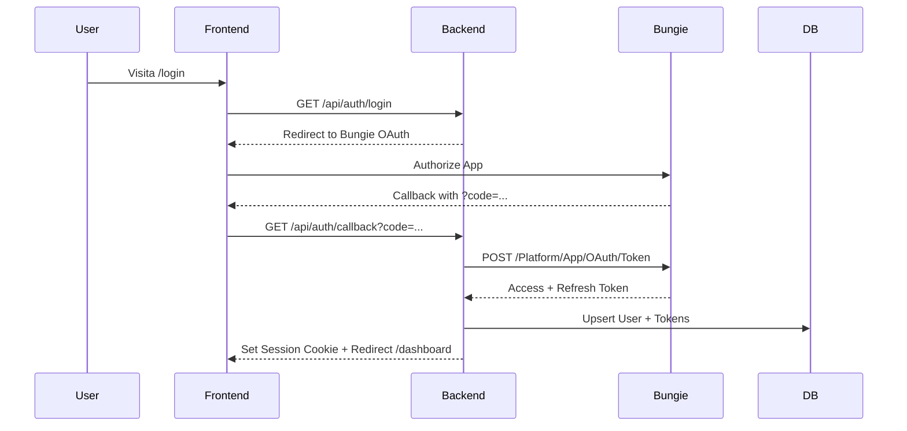
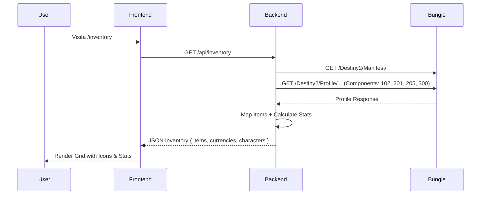
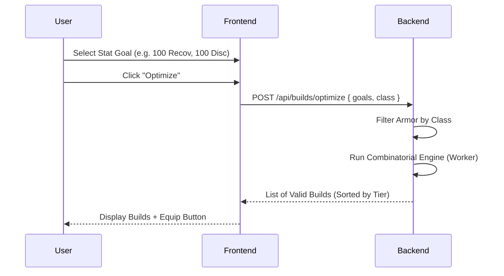
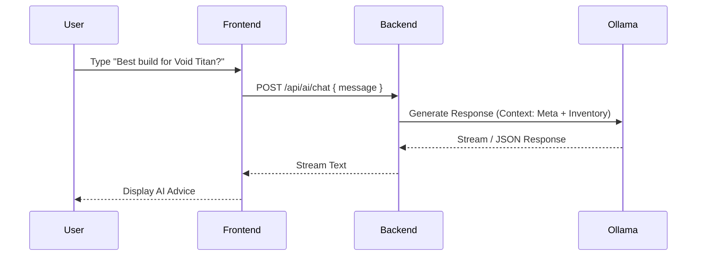

# User Flows (MVP)

## F1: Autenticación con Bungie

```mermaid
sequenceDiagram
    User->>Frontend: Visita /login
    Frontend->>Backend: GET /api/auth/login
    Backend-->>Frontend: Redirect to Bungie OAuth
    Frontend->>Bungie: Authorize App
    Bungie-->>Frontend: Callback with ?code=...
    Frontend->>Backend: GET /api/auth/callback?code=...
    Backend->>Bungie: POST /Platform/App/OAuth/Token
    Bungie-->>Backend: Access + Refresh Token
    Backend->>DB: Upsert User + Tokens
    Backend-->>Frontend: Set Session Cookie + Redirect /dashboard
```

## F2: Sincronización de Inventario

```mermaid
sequenceDiagram
    User->>Frontend: Visita /inventory
    Frontend->>Backend: GET /api/inventory
    Backend->>Bungie: GET /Destiny2/Manifest/
    Backend->>Bungie: GET /Destiny2/Profile/... (Components: 102, 201, 205, 300)
    Bungie-->>Backend: Profile Response
    Backend->>Backend: Map Items + Calculate Stats
    Backend-->>Frontend: JSON Inventory { items, currencies, characters }
    Frontend-->>User: Render Grid with Icons & Stats
```

## F3: Optimización de Build

```mermaid
sequenceDiagram
    User->>Frontend: Select Stat Goal (e.g. 100 Recov, 100 Disc)
    User->>Frontend: Click "Optimize"
    Frontend->>Backend: POST /api/builds/optimize { goals, class }
    Backend->>Backend: Filter Armor by Class
    Backend->>Backend: Run Combinatorial Engine (Worker)
    Backend-->>Frontend: List of Valid Builds (Sorted by Tier)
    Frontend-->>User: Display Builds + Equip Button
```

## F4: AI Advisor Chat

```mermaid
sequenceDiagram
    User->>Frontend: Type "Best build for Void Titan?"
    Frontend->>Backend: POST /api/ai/chat { message }
    Backend->>Ollama: Generate Response (Context: Meta + Inventory)
    Ollama-->>Backend: Stream / JSON Response
    Backend-->>Frontend: Stream Text
    Frontend-->>User: Display AI Advice
```
